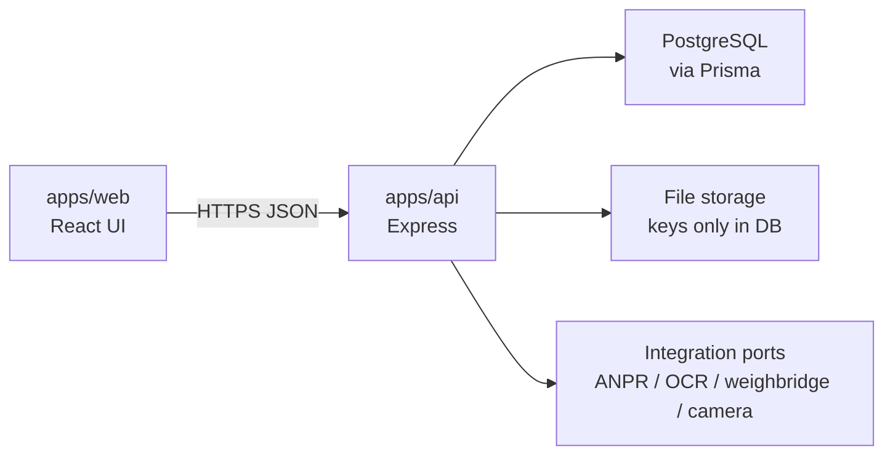
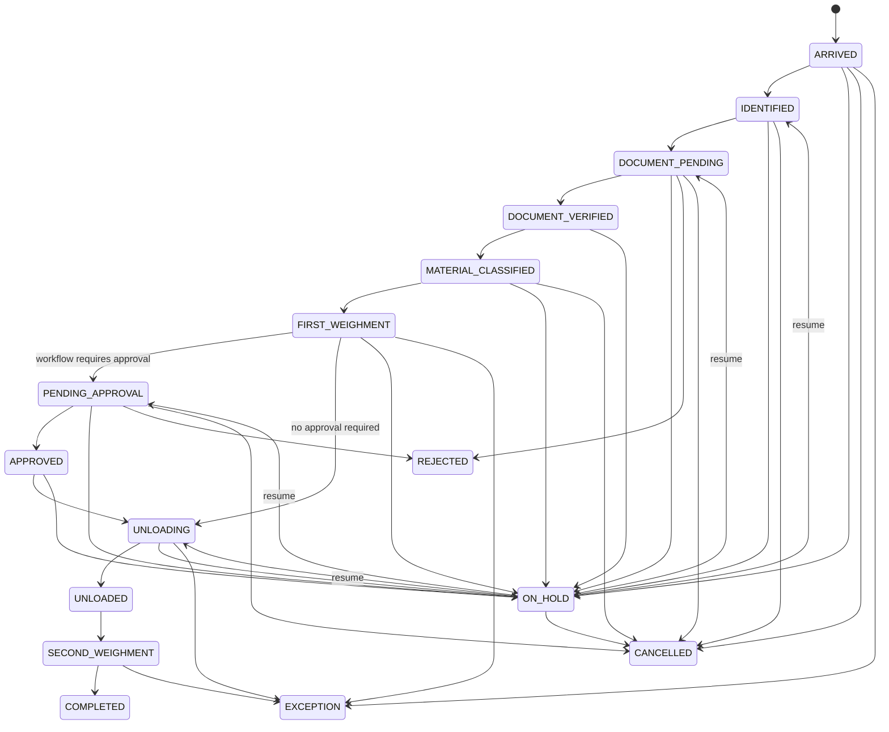
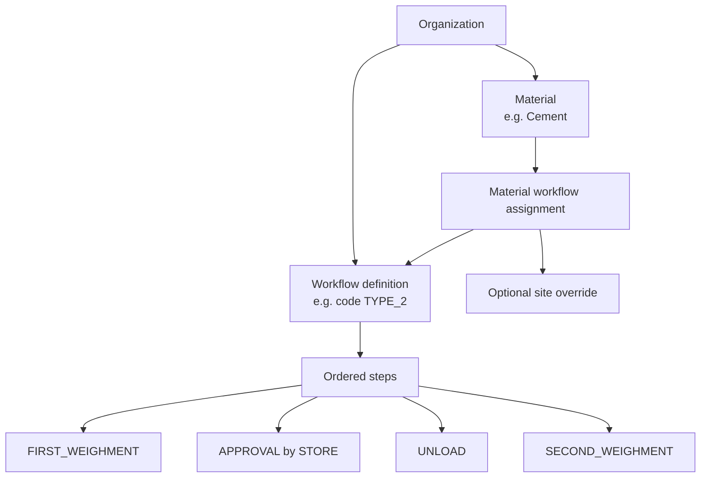

# Trinetra Systems — Architecture

This document explains how Trinetra is intended to work. It is a design for later steps. The running apps were not changed in this step.

**Status:** Step 28  
**Audience:** product owner and future developers  
**Related:** [database-design.md](./database-design.md), [edge-gateway.md](./edge-gateway.md), [offline-first.md](./offline-first.md), [driver-mode.md](./driver-mode.md), [backup-recovery.md](./backup-recovery.md), [restore-procedure.md](./restore-procedure.md), [disaster-recovery.md](./disaster-recovery.md), [database-migration-safety.md](./database-migration-safety.md), [observability.md](./observability.md), [monitoring.md](./monitoring.md), [reporting-analytics.md](./reporting-analytics.md), [multi-tenant-architecture.md](./multi-tenant-architecture.md)

---

## 1. Current project structure

The repository is a pnpm monorepo. Frontend and backend already run independently.

```text
trinetra-systems/
├── apps/
│   ├── web/                      React + TypeScript + Vite
│   │   └── src/
│   │       ├── App.tsx           Login + authenticated landing
│   │       ├── app/              Route guards
│   │       ├── shared/auth/      Session state
│   │       └── modules/auth/     Login and session home
│   └── api/                      Node + TypeScript + Express
│       ├── prisma/schema.prisma  MVP schema + RefreshToken sessions
│       └── src/
│           ├── index.ts          Starts the server
│           ├── app.ts            Health + /api/v1/auth
│           ├── middleware/       Auth, RBAC, rate limit
│           ├── config/           Environment loading
│           ├── db/               Prisma client
│           ├── modules/auth      Login, logout, me
│           └── integrations/     Reserved for ANPR, OCR, hardware
├── docs/
├── package.json
└── pnpm-workspace.yaml
```

The API exposes `GET /health` and `/api/v1/auth`. Login needs PostgreSQL. There is no weighbridge business module and no real hardware.

---

## 2. Overall architecture

Trinetra has three layers. The browser never talks to PostgreSQL.



**Why this split**

- The UI can change without touching business rules.
- Weights, approvals, and net-weight math stay on the server, where they can be validated and audited.
- Cameras and weighbridges plug into **ports** (interfaces). First we use a simulator. Later we swap in a real device without rewriting transactions.

**What we are not building now**

- Full multi-tenant SaaS billing
- Real ANPR, OCR, cameras, or load-cell hardware
- Mobile app or ERP connector
- A workflow engine that lets every organization invent arbitrary new statuses
- A platform-wide superuser that can see every customer (organization `ADMIN` stays inside one tenant)

**Multi-site without over-building**

Every operational record carries `organizationId`, and site-level work carries `siteId`. Organization and site lifecycle (`ACTIVE` / `SUSPENDED` / `ARCHIVED`, site `INACTIVE`) and optional weighbridge-scoped roles were added in Step 28. Adding another company is a new `Organization` row, not a redesign.

---

## 3. Frontend architecture

Do not build these screens yet. This is the target shape of `apps/web`.

```text
apps/web/src/
├── app/                      Routes, auth gate, providers
├── modules/
│   ├── auth/                 Sign-in, session bootstrap
│   ├── weighbridge/          Arrival → weighments → complete
│   ├── store/                Approvals and unloading instructions
│   ├── office/               Management overview
│   ├── security/             Event list (later)
│   ├── admin/                Users, roles, materials, workflows
│   └── transactions/         Shared transaction detail
├── shared/
│   ├── api/                  Typed fetch client
│   ├── auth/                 Token/session helpers
│   ├── permissions/          Hide buttons the API forbids
│   └── ui/                   Small shared components
└── lib/
```

**Screen groups (later)**

| Area | Who uses it | Purpose |
| --- | --- | --- |
| Authentication | All signed-in users | Login and session |
| Department / site context | Users with more than one assignment | Choose current site/department |
| Weighbridge workflow | Operators | Drive the live gate/weighbridge job |
| Store approval | Store officers | Approve, reject, or hold |
| Office dashboard | Managers | Status of today’s transactions — implemented in Step 10 |
| Transaction detail | Several roles | One vehicle job, read-only or action buttons |
| Security alerts | Security / supervisors | Later |
| Reports | Office | Reporting foundation — implemented in Step 10 |
| Admin | Administrators | Users, materials, workflow configuration |

**Rules for the UI**

- The UI does **not** decide that Cement needs Store approval.
- The API returns the transaction, its current status, and **allowed actions** for this user.
- The UI only shows buttons the server said are legal.
- Role names on screen come from the database. They are not hard-coded as the only possible set.

---

## 4. Backend architecture

Keep the existing Express app. Add modules beside it. Do not replace the foundation.

```text
apps/api/src/
├── index.ts
├── app.ts
├── config/
├── db/
├── middleware/               Auth, RBAC, validation, request id
├── domain/                   Status machine, shared types
├── modules/                  One folder per business area
│   ├── auth/
│   ├── users/
│   ├── departments/
│   ├── vehicles/
│   ├── materials/
│   ├── workflows/
│   ├── weighbridges/
│   ├── transactions/
│   ├── weighments/
│   ├── documents/
│   ├── approvals/
│   ├── unloading/
│   ├── security/             Later
│   ├── maintenance/          Later
│   ├── notifications/        In-app events + operational alerts
│   └── audit/
├── integrations/
│   ├── anpr/
│   ├── ocr/
│   ├── weighbridge/
│   └── camera/
└── lib/
```

Each module should stay thin at the HTTP edge:

1. **Route** — path, method, auth
2. **Validator** — reject bad input before business logic
3. **Service** — rules, workflow, net-weight calculation
4. **Repository** — Prisma only

**Integration ports**

```text
WeighbridgeReader.readWeight(weighbridgeId) → { kg, readAt, source }
AnprReader.readPlate(cameraId) → { plate, confidence, source }
OcrReader.extract(documentId) → { fields, source }
```

`source` will be `SIMULATED` until real devices exist. Services must never assume a camera can prove that a load-cell cable was cut. A camera can only contribute a **signal**. Rules may later correlate several signals into an event.

---

## 5. API module structure

Version the HTTP API as `/api/v1/...`. Keep the existing `/health` endpoint.

### MVP (implement with features, not all at once)

| Module | Base path | Purpose |
| --- | --- | --- |
| Auth | `/api/v1/auth` | Login, logout, refresh |
| Users | `/api/v1/users` | User administration |
| Departments | `/api/v1/departments` | Org departments |
| Roles | `/api/v1/roles` | Configurable roles and permissions |
| Vehicles | `/api/v1/vehicles` | Vehicle master data |
| Drivers | `/api/v1/drivers` | Driver master data |
| Suppliers | `/api/v1/suppliers` | Supplier master data |
| Materials | `/api/v1/materials` | Materials and classification assignment |
| Workflows | `/api/v1/workflows` | Workflow definitions and steps |
| Weighbridges | `/api/v1/weighbridges` | Site equipment |
| Transactions | `/api/v1/transactions` | Lifecycle of one vehicle visit |
| Weighments | `/api/v1/transactions/:id/weighments` | Record weights |
| Documents | `/api/v1/transactions/:id/documents` | Upload and verify (no real OCR yet) |
| Approvals | `/api/v1/transactions/:id/approvals` | Decisions |
| Unloading | `/api/v1/transactions/:id/unloading` | Instruction and completion |
| Audit | `/api/v1/dashboard/audit` | Read-only audit queries for authorized roles |
| Dashboard | `/api/v1/dashboard` | KPI, live monitoring, exceptions, operational alerts |
| Reports | `/api/v1/reports` | Transaction, material, vehicle, exception reports |
| Notifications | `/api/v1/notifications` | In-app inbox, unread count, preferences |
| Alerts | `/api/v1/alerts` | Operational alert list, acknowledge, resolve |

### Later

| Module | Base path | Why later |
| --- | --- | --- |
| Security | `/api/v1/security` | Needs rules and simulated signals first |
| Maintenance | `/api/v1/maintenance` | Needs security rules that respect maintenance |

**Cross-cutting API rules**

- Authenticated by default, except `/health` and login.
- Every mutating request is authorized by permission, not by role name alone.
- The client cannot set `netWeightKg`, cannot pick an arbitrary next status, and cannot send a different `organizationId` than the user’s org.
- List endpoints are paginated.

---

## 6. Transaction state machine

Statuses are **platform-level**. They stay stable so screens and reports can understand them. Which statuses a given material **visits** is configurable.



**Happy path (typical inbound load that needs store approval)**

ARRIVED → IDENTIFIED → DOCUMENT_PENDING → DOCUMENT_VERIFIED → MATERIAL_CLASSIFIED → FIRST_WEIGHMENT → PENDING_APPROVAL → APPROVED → UNLOADING → UNLOADED → SECOND_WEIGHMENT → COMPLETED

**Flexible path**

If the material’s workflow has no approval step, the engine skips `PENDING_APPROVAL` and `APPROVED`.

**Exception statuses**

| Status | Meaning |
| --- | --- |
| `ON_HOLD` | Pause. Remember the previous status so work can resume. |
| `REJECTED` | A required check or approval failed. Terminal unless a supervisor reopens later. |
| `CANCELLED` | Stopped by an authorized user. Terminal. |
| `EXCEPTION` | Process cannot continue until investigated (bad weight, missing data, conflict). |

The previous status is stored on the transaction (`heldFromStatus`) so hold/resume is not guesswork.

---

## 7. Approval workflow design

Approvals are **records**, not a boolean on the transaction.

An approval row can store:

- Transaction
- Workflow step / stage number
- Department that must decide
- Approver (when decided)
- Decision: `PENDING`, `APPROVED`, `REJECTED`, `HOLD`
- Comments / reason
- Requested and decided timestamps

A workflow may define **zero, one, or several** approval stages (for example Store, then Lab). The transaction stays in `PENDING_APPROVAL` until every required stage for that workflow is `APPROVED`.

`HOLD` on an approval puts the transaction `ON_HOLD`. `REJECTED` moves the transaction to `REJECTED`.

The UI never invents a department. The workflow configuration says who must approve.

---

## 8. Material and workflow configuration

Type 1 / Type 2 / Type 3 are **labels an organization defines**. They are not industry standards and they are not coded as “Cement = Type 2”.



**How an organization would configure Cement as Type 2**

1. Create a workflow definition with code `TYPE_2` and a human name such as “Store-approved inbound”.
2. Add steps, including an approval step assigned to the Store department.
3. Create material `CEMENT`.
4. Assign that material to the `TYPE_2` workflow (optionally only at one site).

Another organization can assign Cement to a different workflow, or invent `TYPE_4`.

**What lives in data, not in React or `if` statements**

- Material list
- Workflow codes and names
- Which steps run
- Which department approves
- Whether a step is required

**What stays in code (platform capabilities)**

- How to record a weighment
- How to compute net weight
- How to store an approval
- How to write an audit row

The engine maps a step’s `capability` (`CAPTURE_DOCUMENTS`, `FIRST_WEIGHMENT`, `APPROVAL`, …) to those platform actions.

---

## 9. Security event design

Security is a **correlation layer**, not a camera verdict.

A device or rule emits a **signal** (weight spike, person in frame, door open, operator acknowledgement). A later rule engine may group signals and create a `SecurityEvent` with one of:

| Severity | Use |
| --- | --- |
| `ANOMALY` | Unexpected but not automatically hostile |
| `SUSPICIOUS_EVENT` | Needs human review |
| `HIGH_RISK_EVENT` | Escalate now |

Do **not** store a claim such as “camera proved the load-cell wire was cut”. Store facts: “camera motion near the pit” plus “weight changed while marked empty”. A human or a later rule may call that tamper **suspicion**.

Events can share a `correlationKey` so several signals become one incident.

Step 16 implements the weight-signal path: normalized readings create `WeightAnomalyEvent` rows and a companion `SecurityEvent` (`WEIGHT_ANOMALY`). Camera, restricted-zone, and person-detection signals remain future work. The engine records abnormal measurement behavior; it does not prove fraud or a cut load-cell wire.

---

## 10. Maintenance mode

Maintenance is a dated, attributed record. It is not a global “turn security off” switch.

A maintenance record includes user, start, end, reason, status, and related site/weighbridge.

While a weighbridge is in active maintenance:

- Weight and access **signals still record**
- Automatic escalation can be quieter or tagged `maintenance`
- Audit logging continues
- Ending maintenance is an explicit action

---

## 11. Audit-log design

Important actions write an append-only audit row. There is no update/delete API for audit records.

Typical actions: login, transaction created, weight recorded, approval, rejection, material changed, workflow changed, maintenance started, security event acknowledged.

Each row stores actor, action, entity type, entity id, timestamp, and JSON metadata (for example old/new status). See [database-design.md](./database-design.md) for fields.

---

## 12. Weighment and net weight

A transaction may have many weighment rows.

MVP convention:

- First operational weighment of kind `GROSS` = gross weight
- First operational weighment of kind `TARE` = tare weight
- **Net weight = gross − tare**
- Only the backend calculates and stores net weight
- The client must not send the final net weight

Additional rows of kind `OTHER` are allowed later (check weighments, reweighs).

`source` on each weighment will be `MANUAL`, `SIMULATED`, or `HARDWARE` so we never pretend a typed number came from a device.

---

## 13. Recommended implementation order

1. Prisma schema for MVP tables (after you approve this design)
2. Seed one organization, one site, core departments, permission catalog
3. Authentication and role-based access
4. Admin: users, roles, departments
5. Materials and workflow configuration
6. Vehicles, drivers, suppliers, weighbridges
7. Transactions and the state machine
8. Weighments and backend net-weight calculation
9. Documents (upload and manual verify; OCR simulated later)
10. Approvals
11. Unloading
12. Audit reads and guarantees that every mutation above writes audit
13. Simulated ANPR / weighbridge / OCR ports
14. Security events and maintenance mode
15. Notifications, reports, offline sync, ERP

---

## 14. Scalability concerns

- Transaction and audit tables will grow fastest. Paginate from day one. Partition audit later if needed.
- Do not store document bytes in PostgreSQL. Store a file key.
- Do not load unbounded lists with `.collect()`-style fetches.
- Unique vehicle plates and reference numbers must be scoped per organization.
- Offline sync later will be easier if primary keys are UUIDs, not sequential integers.

---

## 15. Security concerns

- Passwords hashed with bcrypt (12 rounds). JWT secrets only in environment variables.
- 8-hour JWT in an httpOnly cookie (`trinetra_session`). Server-side `RefreshToken` rows store a SHA-256 of the JWT so logout can revoke the session. The token is not kept in localStorage.
- Authorize every write. Never trust the client’s role, org, or next status.
- Limit JSON body size (already 1 MB) and later limit upload types/sizes.
- Audit log is append-only.
- CORS stays locked to the known frontend origin.
- Hardware credentials never go to the browser.

---

## 16. Architectural risks

| Risk | Why it matters | Mitigation |
| --- | --- | --- |
| Hard-coding Type 1/2/3 | Wrong for the next customer | Workflow tables, not `if (cement)` |
| Status enum too rigid | Some materials skip approvals | Engine skips steps the workflow does not include |
| Forgetting `organizationId` | Painful when a second company or site appears | Required on operational tables from the first schema |
| Client-side net weight | Fraud and rounding disputes | Server-only calculation |
| Camera-as-proof | False legal claims | Signals vs events; wording in the data model |
| Building security/ERP too early | Slows the MVP | Tables designed, implementation deferred |
| Fully dynamic statuses | Reports and UI become chaos | Fixed platform statuses, configurable paths |

---

## 17. What this step did not do

- No Prisma models were added
- No login, dashboards, or workflow screens
- No ANPR, OCR, camera, or weighbridge integrations
- No change to the running `/health` server or Vite welcome page
