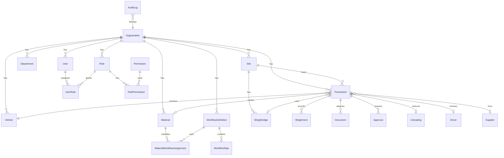

# Trinetra Systems — Database Design

PostgreSQL model implemented in `apps/api/prisma/schema.prisma`. Apply the initial migration after you configure a local `DATABASE_URL`.

**Related:** [architecture.md](./architecture.md), [backup-recovery.md](./backup-recovery.md), [database-migration-safety.md](./database-migration-safety.md)

---

## 1. Design choices

| Choice | Decision | Simple reason |
| --- | --- | --- |
| Primary keys | UUID (`cuid` or `uuid`) | Safer for later offline sync than 1, 2, 3… |
| Multi-site | `organizationId` on operational tables; `siteId` where work happens | One site now, more later, no redesign |
| Roles | Tables, not a fixed enum | Each company can add or rename roles |
| Departments | Table, not a fixed enum | Core seven are seeded; others can be added |
| Workflow types | Data (workflow definitions) | Type 1/2/3 are labels, not coded facts |
| Transaction status | Prisma enum of platform states | Screens and reports need a stable vocabulary |
| Weights | `Decimal(12,3)` kilograms | Never use floating point for money-like weights |
| Net weight | Backend-written snapshot on the transaction | Users cannot type the answer |
| Soft delete | Users, vehicles, materials, suppliers, departments | Hide from lists; keep history |
| Hard history | Transactions, weighments, approvals, audit | Legal/operational record |
| Files | Store object key + metadata only | Database does not hold images/PDFs |

Suggested core departments to **seed** (not freeze in an enum): `WEIGHBRIDGE`, `STORE`, `LAB`, `PLANT`, `SITE`, `OFFICE`, `OTHERS`.

Suggested roles to **seed** as examples: `ADMIN`, `WEIGHBRIDGE_OPERATOR`, `STORE_OFFICER`, `SUPERVISOR`, `LAB_USER`, `PLANT_USER`, `SITE_USER`, `OFFICE_MANAGER`, `SECURITY_USER`, `DRIVER`. Organizations may add more.

---

## 2. MVP entities versus later entities

### Create in the first Prisma schema (after approval)

Organization, Site, Department, User, Role, Permission, RolePermission, UserRole, Vehicle, Driver, Supplier, Material, WorkflowDefinition, WorkflowStep, MaterialWorkflowAssignment, Weighbridge, Transaction, Weighment, Document, Approval, Unloading, AuditLog.

RefreshToken can be added in the same schema when authentication is implemented, or in that step if we split migrations. Prefer including it with auth so logout can be revoked.

### Design now, implement later

| Entity | Why wait |
| --- | --- |
| SecurityEvent | Needs signals and rules, not just a table |
| MaintenanceEvent | Useful once security rules exist |
| Notification | Useful once there are events to send |
| IntegrationOutbox | ERP / offline sync |
| Device / Camera | Real hardware inventory |

### Not needed as tables now

- Report snapshots
- A separate “Type” table besides workflow definitions
- Per-country tax tables
- Full ERP vendor catalog

---

## 3. Relationships (high level)

---

## 4. Entity fields

Required unless marked optional. Every table below also has `id` (UUID) unless noted.

### Organization

| Field | Required | Notes |
| --- | --- | --- |
| name | yes | Display name |
| slug | yes | Unique URL-safe code |
| createdAt, updatedAt | yes | |

First deploy: seed one organization.

### Site

| Field | Required | Notes |
| --- | --- | --- |
| organizationId | yes | FK |
| name | yes | |
| code | yes | Unique per organization |
| timezone | yes | Default `Asia/Kolkata` is an app default, not a hard business rule |
| createdAt, updatedAt | yes | |
| deletedAt | optional | Soft delete |

### Department

| Field | Required | Notes |
| --- | --- | --- |
| organizationId | yes | |
| code | yes | Unique per org. Seeded values listed above |
| name | yes | Can be renamed; code stays stable |
| isSystem | yes | Seeded rows are system; custom rows are not |
| createdAt, updatedAt | yes | |
| deletedAt | optional | |

### Permission

Global catalog, not per organization.

| Field | Required | Notes |
| --- | --- | --- |
| code | yes | Unique, e.g. `transaction.create`, `weighment.record`, `approval.decide` |
| name | yes | |
| group | yes | For admin UI grouping |

### Role

| Field | Required | Notes |
| --- | --- | --- |
| organizationId | yes | |
| code | yes | Unique per org |
| name | yes | |
| description | optional | |
| isSystem | yes | Seeded starter roles |
| createdAt, updatedAt | yes | |

### RolePermission

| Field | Required | Notes |
| --- | --- | --- |
| roleId | yes | |
| permissionId | yes | Unique pair `(roleId, permissionId)` |

### User

| Field | Required | Notes |
| --- | --- | --- |
| organizationId | yes | |
| email | yes | Unique per organization |
| passwordHash | yes | Never store plaintext |
| fullName | yes | |
| isActive | yes | |
| defaultSiteId | optional | |
| defaultDepartmentId | optional | |
| createdAt, updatedAt | yes | |
| deletedAt | optional | |

### UserRole

| Field | Required | Notes |
| --- | --- | --- |
| userId | yes | |
| roleId | yes | Must belong to the same organization |
| siteId | optional | Null = all sites in the org (typical for admin) |
| createdAt | yes | Unique `(userId, roleId, siteId)` |

### Vehicle

| Field | Required | Notes |
| --- | --- | --- |
| organizationId | yes | |
| registrationNumber | yes | Normalized (uppercase, no spaces). Unique per org |
| displayRegistrationNumber | yes | As printed on the plate |
| vehicleType | optional | Truck, tanker, … |
| notes | optional | |
| createdAt, updatedAt | yes | |
| deletedAt | optional | |

ANPR later writes or matches `registrationNumber`. Do not invent extra ANPR tables now.

### Driver

| Field | Required | Notes |
| --- | --- | --- |
| organizationId | yes | |
| fullName | yes | |
| licenseNumber | optional | Unique per org when present |
| phone | optional | |
| userId | optional | Only if the driver later logs in |
| createdAt, updatedAt | yes | |
| deletedAt | optional | |

### Supplier

| Field | Required | Notes |
| --- | --- | --- |
| organizationId | yes | |
| name | yes | |
| code | optional | Unique per org when present |
| createdAt, updatedAt | yes | |
| deletedAt | optional | |

### Material

| Field | Required | Notes |
| --- | --- | --- |
| organizationId | yes | |
| code | yes | Unique per org, e.g. `CEMENT` |
| name | yes | |
| description | optional | |
| createdAt, updatedAt | yes | |
| deletedAt | optional | |

No `type` column. Classification is an assignment to a workflow.

### WorkflowDefinition

| Field | Required | Notes |
| --- | --- | --- |
| organizationId | yes | |
| code | yes | Unique per org. May be `TYPE_1`, `TYPE_2`, `INBOUND_STORE` |
| name | yes | Human label |
| description | optional | |
| isActive | yes | |
| createdAt, updatedAt | yes | |

### WorkflowStep

| Field | Required | Notes |
| --- | --- | --- |
| workflowDefinitionId | yes | |
| sortOrder | yes | Unique per workflow |
| capability | yes | Platform action key (see below) |
| name | yes | |
| isRequired | yes | |
| approvalDepartmentId | optional | Set when capability is `APPROVAL` |

**Capability keys (code, not customer-editable meaning):**  
`IDENTIFY_VEHICLE`, `CAPTURE_DOCUMENTS`, `VERIFY_DOCUMENTS`, `CLASSIFY_MATERIAL`, `FIRST_WEIGHMENT`, `APPROVAL`, `UNLOAD`, `SECOND_WEIGHMENT`, `COMPLETE`

### MaterialWorkflowAssignment

| Field | Required | Notes |
| --- | --- | --- |
| organizationId | yes | |
| materialId | yes | |
| workflowDefinitionId | yes | |
| siteId | optional | Null = default for all sites |
| effectiveFrom | yes | |
| effectiveTo | optional | |
| createdAt, updatedAt | yes | |

Lookup rule: prefer a site-specific assignment, else the org default, else the transaction cannot classify.

Unique active assignment: one default per material, and one per material+site.

### Weighbridge

| Field | Required | Notes |
| --- | --- | --- |
| organizationId | yes | |
| siteId | yes | |
| code | yes | Unique per site |
| name | yes | |
| isActive | yes | |
| createdAt, updatedAt | yes | |

Hardware identity stays in integrations later, not as fake device rows.

### Transaction

One vehicle visit / job.

| Field | Required | Notes |
| --- | --- | --- |
| organizationId | yes | |
| siteId | yes | |
| referenceNumber | yes | Unique per organization. System generated |
| status | yes | Platform enum |
| heldFromStatus | optional | Used with `ON_HOLD` |
| vehicleId | optional | Filled when identified |
| driverId | optional | |
| supplierId | optional | |
| materialId | optional | Filled when classified |
| workflowDefinitionId | optional | Copied at classification so later config edits do not rewrite history |
| weighbridgeId | optional | |
| arrivedAt | yes | |
| completedAt | optional | |
| netWeightKg | optional | **Backend only** after tare exists |
| holdReason | optional | |
| cancelledReason | optional | |
| exceptionReason | optional | |
| createdByUserId | yes | |
| createdAt, updatedAt | yes | |

The client cannot patch `status` or `netWeightKg` as free-form fields. Services transition state.

### Weighment

| Field | Required | Notes |
| --- | --- | --- |
| transactionId | yes | |
| weighbridgeId | optional | |
| sequence | yes | 1, 2, 3… Unique per transaction |
| kind | yes | `GROSS`, `TARE`, `OTHER` |
| weightKg | yes | Decimal |
| recordedAt | yes | |
| recordedByUserId | yes | |
| source | yes | `MANUAL`, `SIMULATED`, `HARDWARE` |
| rawPayload | optional | JSON for future device data |
| createdAt | yes | |

Net weight is not a user-editable weighment kind.

### Document

| Field | Required | Notes |
| --- | --- | --- |
| organizationId | yes | |
| transactionId | yes | |
| uploadedByUserId | yes | |
| documentType | yes | String: `INVOICE`, `ID_PROOF`, `WEIGH_SLIP`, `OTHER`, plus org-specific later |
| storageKey | yes | Object storage path |
| originalFileName | yes | |
| mimeType | yes | |
| status | yes | `UPLOADED`, `PROCESSING`, `EXTRACTED`, `VERIFIED`, `REJECTED` |
| ocrStatus | yes | `NOT_STARTED` for MVP |
| extractedData | optional | JSON. Simulated OCR later |
| verifiedByUserId | optional | |
| createdAt, updatedAt | yes | |

### Approval

| Field | Required | Notes |
| --- | --- | --- |
| transactionId | yes | |
| workflowStepId | optional | Links to the configured stage |
| stage | yes | 1, 2, … |
| departmentId | yes | Who must decide |
| decision | yes | `PENDING`, `APPROVED`, `REJECTED`, `HOLD` |
| approverUserId | optional | Set when decided |
| comments | optional | |
| requestedAt | yes | |
| decidedAt | optional | |
| createdAt, updatedAt | yes | |

### Unloading

One instruction record per transaction for MVP. More rows can be allowed later.

| Field | Required | Notes |
| --- | --- | --- |
| transactionId | yes | Unique for MVP |
| instructedByUserId | optional | |
| locationNote | optional | Bay / hopper / yard |
| notes | optional | |
| status | yes | `NOT_STARTED`, `IN_PROGRESS`, `COMPLETED` |
| startedAt | optional | |
| completedAt | optional | |
| completedByUserId | optional | |
| createdAt, updatedAt | yes | |

### AuditLog

Append-only. No `updatedAt`. No soft delete.

| Field | Required | Notes |
| --- | --- | --- |
| organizationId | yes | |
| actorUserId | optional | Null for system jobs |
| action | yes | e.g. `user.login`, `weighment.recorded` |
| entityType | yes | e.g. `Transaction` |
| entityId | yes | |
| occurredAt | yes | |
| ipAddress | optional | |
| userAgent | optional | |
| metadata | optional | JSON |

### RefreshToken (with authentication)

| Field | Required | Notes |
| --- | --- | --- |
| userId | yes | |
| tokenHash | yes | Store hash, not the raw token |
| expiresAt | yes | |
| revokedAt | optional | |
| createdAt | yes | |

---

## 5. Later entities (fields reserved in design)

### SecurityEvent

| Field | Notes |
| --- | --- |
| organizationId, siteId | Scope |
| weighbridgeId | Optional |
| severity | `ANOMALY`, `SUSPICIOUS_EVENT`, `HIGH_RISK_EVENT` |
| category | `WEIGHT_ANOMALY`, `ACCESS`, `TAMPER_SUSPICION`, `PERSON_DETECTION`, `MAINTENANCE`, `OTHER` |
| title, description | Human text |
| source | `SIMULATED`, `CAMERA`, `WEIGHBRIDGE`, `USER`, `RULE_ENGINE` |
| correlationKey | Optional group of signals |
| status | `OPEN`, `ACKNOWLEDGED`, `DISMISSED` |
| acknowledgedByUserId, acknowledgedAt | Optional |
| metadata | JSON facts, not legal conclusions |
| occurredAt | |

### MaintenanceEvent

| Field | Notes |
| --- | --- |
| organizationId, siteId | |
| weighbridgeId | Optional equipment target |
| startedByUserId | Required |
| endedByUserId | Optional |
| startedAt | Required |
| endedAt | Optional |
| reason | Required |
| status | `ACTIVE`, `COMPLETED`, `CANCELLED` |
| notes | Optional |

### Notification

| Field | Notes |
| --- | --- |
| organizationId, siteId, recipientUserId | Site is optional for legacy rows |
| type, category, severity, title, message | Type is a string so legacy `APPROVAL_REQUESTED` can map to `APPROVAL_REQUIRED` |
| entityType, entityId | Reference the original record. Do not copy transaction payloads |
| transactionId, approvalId | Optional relations |
| eventKey | Unique with recipient. Idempotency for the same event |
| readAt | Null until the recipient reads it |

### NotificationPreference

| Field | Notes |
| --- | --- |
| userId, category | Unique. Categories: `WORKFLOW`, `APPROVAL`, `EXCEPTION`, `SYSTEM` |
| inAppEnabled | Default true. Channel preferences are later |

### OperationalAlert

| Field | Notes |
| --- | --- |
| organizationId, siteId | Required scope |
| type, severity, title, message | Parallel to notifications, not a second exception engine |
| status | `OPEN`, `ACKNOWLEDGED`, `RESOLVED` |
| transactionId, entityType, entityId | Optional references |
| eventKey | Unique per organization |
| acknowledgedByUserId, acknowledgedAt, resolvedByUserId, resolvedAt | Lifecycle actors |

---

## 6. Enums (platform-level)

Use Prisma enums only where the **platform** owns the vocabulary.

| Enum | Values |
| --- | --- |
| TransactionStatus | `ARRIVED`, `IDENTIFIED`, `DOCUMENT_PENDING`, `DOCUMENT_VERIFIED`, `MATERIAL_CLASSIFIED`, `FIRST_WEIGHMENT`, `PENDING_APPROVAL`, `APPROVED`, `UNLOADING`, `UNLOADED`, `SECOND_WEIGHMENT`, `COMPLETED`, `ON_HOLD`, `REJECTED`, `CANCELLED`, `EXCEPTION` |
| WeighmentKind | `GROSS`, `TARE`, `OTHER` |
| WeighmentSource | `MANUAL`, `SIMULATED`, `HARDWARE` |
| ApprovalDecision | `PENDING`, `APPROVED`, `REJECTED`, `HOLD` |
| DocumentStatus | `UPLOADED`, `PROCESSING`, `EXTRACTED`, `VERIFIED`, `REJECTED` |
| OcrStatus | `NOT_STARTED`, `SIMULATED`, `COMPLETED`, `FAILED` |
| UnloadingStatus | `NOT_STARTED`, `IN_PROGRESS`, `COMPLETED` |
| WorkflowCapability | listed in WorkflowStep |
| SecuritySeverity | later |
| MaintenanceStatus | later |

Do **not** enum material types, role codes, or department codes.

---

## 7. Important unique constraints and indexes

### Unique

| Table | Unique on |
| --- | --- |
| Organization | slug |
| Site | (organizationId, code) |
| Department | (organizationId, code) |
| Permission | code |
| Role | (organizationId, code) |
| RolePermission | (roleId, permissionId) |
| User | (organizationId, email) |
| UserRole | (userId, roleId, siteId) |
| Vehicle | (organizationId, registrationNumber) |
| Driver | (organizationId, licenseNumber) where license present |
| Supplier | (organizationId, code) where code present |
| Material | (organizationId, code) |
| WorkflowDefinition | (organizationId, code) |
| WorkflowStep | (workflowDefinitionId, sortOrder) |
| Weighbridge | (siteId, code) |
| Transaction | (organizationId, referenceNumber) |
| Weighment | (transactionId, sequence) |
| Unloading | transactionId (MVP one-to-one) |

Soft-deleted rows must not block reuse of a code or plate. Use PostgreSQL **partial unique indexes** (`WHERE deletedAt IS NULL`) when those tables are created.

### Indexes (beyond foreign keys)

| Table | Index | Why |
| --- | --- | --- |
| Transaction | (organizationId, status) | Operator queues |
| Transaction | (organizationId, siteId, arrivedAt) | Site daily list |
| Transaction | (vehicleId, arrivedAt) | Vehicle history |
| Weighment | (transactionId, recordedAt) | Weight timeline |
| Document | (transactionId) | Detail page |
| Approval | (transactionId, stage) | Workflow progress |
| AuditLog | (organizationId, occurredAt) | Admin history |
| AuditLog | (entityType, entityId) | “What happened to this record?” |
| UserRole | (userId) | Authorization |
| MaterialWorkflowAssignment | (materialId, siteId, effectiveFrom) | Classification lookup |

Prisma already indexes foreign keys.

---

## 8. Validation rules the database cannot own alone

The API must still enforce:

- Net weight is never accepted from the client
- Status changes only through the workflow engine
- Gross and tare must be positive; tare must be less than gross when both exist
- Approval can only be decided by a user with permission in that department (and site)
- Workflow assignment must belong to the same organization as the material
- File types and sizes for documents

---

## 9. Scalability notes

- `BackupRun` stores backup metadata only (status, size, checksum, relative name). It is not a backup file and is not a restore API.
- `AuditLog` and `Transaction` are the growth tables. Keep them append-friendly. Do not update audit rows.
- `metadata` / `extractedData` / `rawPayload` JSON is for extensibility, not for fields we already know we will query often.
- When a second weighbridge or site appears, no table split is required if `siteId` and `weighbridgeId` are present from the start.

---

## 10. Open items to confirm before schema implementation

These are small product choices, not blockers:

1. Should a driver without a license number be allowed?
2. Should transaction `referenceNumber` be human-readable (e.g. `TRN-2026-000123`) or a short random code?
3. Timezone: store all timestamps in UTC (recommended) and display in the site timezone.

Recommended defaults if you do not want to decide now: license optional, human-readable yearly counter per organization, UTC in the database.
